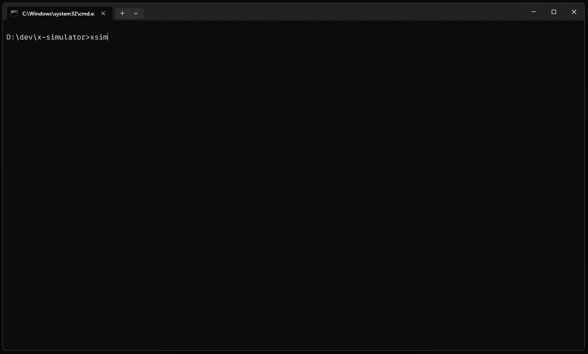
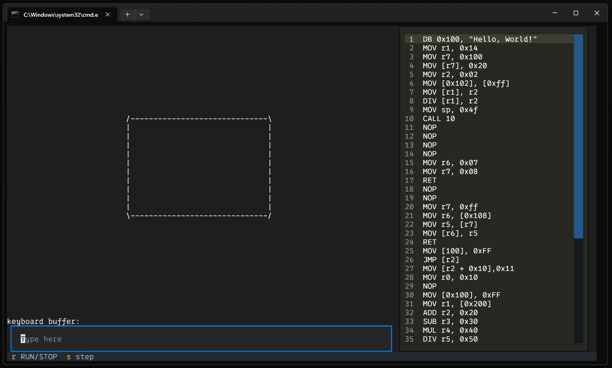

# XSIM

This is the documentation for x-simulator, a simulator of a computing system.

## Requirements

Before installing and using x-simulator, ensure your system meets the following requirements:

1. **Python** x-simulator is a python package and requires Python 3.10 or later. You can download Python from the official Python website [here](https://www.python.org/downloads/).

2. **pip** pip is a package manager for Python and is used to install python packages. If you installed Python from the official website, pip should have been installed along with it. If not, you can follow the instructions [here](https://pip.pypa.io/en/stable/installation/) to install pip. Other tools with same capability can be used.

3. **Operating System** x-simulator is platform-independent and should work on any operating system that supports Python. This includes Windows, macOS, and Linux.

4. **Hardware:** The hardware requirements for x-Simulator depend on the complexity of the simulations you want to run. For basic simulations, a standard consumer-grade computer should be sufficient. For more complex simulations, a high-performance computer with a fast processor and a large amount of RAM might be necessary.

Please ensure that your system meets these requirements before proceeding with the installation.

## Installing

You can install `x-simulator` using pip, a package manager for Python. Follow these steps:

1. **Open your terminal:** You'll run the installation command in your terminal.

2. **Run the installation command:** Enter the following command in your terminal and press Enter:

```bash
pip install x-simulator
```

Alternatively, the installation process can be done with the source file directly. After cloning this repository perform `pip install <location/to/the/repo>`

```bash
git clone https://github.com/AdrianCert/x-simulator.git
```

```bash
pip install x-simulator
```

3. **Wait for the installation to complete:** pip will download and install x-simulator and its dependencies. This might take a few minutes.

4. **Verify the installation:** To make sure x-simulator was installed correctly, start a Python interactive session by typing python in your terminal and pressing Enter. Then, try to import x-simulator module by typing `import xsim` (or the correct import name if it's different) and pressing Enter. If you don't see any error messages, the installation was successful.

## Development Installation

If you want to contribute to the development of `x-simulator`, you'll need to clone the repository and install the dependencies in a virtual environment. Here are the steps:

1. **Clone the repository:** Open your terminal, navigate to the directory where you want to clone the repository, and run the following command:

```bash
git clone https://github.com/AdrianCert/x-simulator.git
```
2. **Navigate to the cloned repository:** Use the following command to navigate to the x-simulator directory:

```bash
cd x-simulator
```

3. **Run the installation command:** Enter the following command in your terminal and press Enter:


```bash
pip install -e .
```

As note, in order to be able to decouple usage dependencies in the package and the others, separate groups of dependencies were put into modules. You can install those adjusting the syntax `.` -> `.[dev]` or `.[test]` or `.[test,dev]` (or separated via comma). see [pep631](https://peps.python.org/pep-0631/)

## Usage

In your terminal you can execute directly `xsim` or run the file `src/xsim/app/gui.py`. The interface will rendered direct in your terminal.




The main layout is organized in 2 columns and a footer. In the left you will see the devices representation and in the right the code editor. On footer quick actions are found.


### layout components

**the display** located in the first column in top, is rendered with a text border. Each character on this component is the utf-8 representation loaded from the video buffer. Each row is located on the video buffer location with the offset computed based on `video_row_width * number_of_row`. This buffer is filled with `0x32` witch is the space character.

**keyboard buffer** located in the first column bottom, is represented by a overview of the buffer status and an input field that is send to the keyboard buffer.

**the code preview** locater in the right column. A full file text is represented. The cursor is in the sync with the current instruction that will be executed.

### Basic operation

**run** run entire code without stop by clicking on the `RUN/STOP` button. By clicking second time the execution will be stopped.

**step** execute only one instruction.

**keyboard buffer** by typing into input the code will be transmitted directly the the keyboard buffer

### Configuration

The procession can be configured in order to be customable. The configuration is done before starting on the program via a configuration file location on the location where you want to execute (current working directory) named `config.json`. That file will be loaded and parsed as json document that latter will serve as configuration keys for the program.

The keys are following:

**memory_size** -> the total memory available for the simulated processor.

**clock_speed** -> the maximum instruction executed in a second during `run` action.

**program_path** -> the source file of the program that will be loader into simulated processor memory.

**keyboard_memory_location** -> the offset in the memory for the keyboard buffer

**video_memory_location** -> the offset in the memory for the video buffer

**video_memory_size** -> the size allocated for the video buffer

**video_memory_w_size** -> the display width size

**video_memory_h_size** -> the display height size

**flags_names** -> list of flag names that are used on the simulated processor

**registers_spec** -> configuration for the simulated processor registers

**registers_spec.memory_mapped** -> the range of the simulated processor memory that is used to store the registers.

**registers_spec.registers** -> list of the registers used by the simulated processor. Those should be the same that are used on the code.

**registers_spec.registers[].name** -> the name of the register, the name is used on program source and should be lower case.

**registers_spec.registers[].size** -> the amount of bytes that is used by the register.

**registers_spec.registers[].description** -> a short description for the register.

**registers_spec.registers[].default** -> the default value that will be loader in the register.

## The main components

* `the processor`
* `the memory`
* `the peripheral devices`

# Main Components Explanation
We will now proceed to give a brief presentation of the essential modules in this project.

### 1. The Procesor

The role of a processor is to simulate the operations of a real-world processor. The processor is responsible for interpreting and executing program code, managing registers, accessing memory, and other tasks specific to data processing and instruction execution.

The ProcessorRegisters class in the code is responsible for managing the processor's registers within the simulator. Specifically, this class has the following functionalities and responsibilities:

* Initializes a memory area for the processor's registers.
* Creates and stores ProcessorRegister objects for each register of the processor.
* Associates each register with a memory area within the processor's memory.
* Provides methods for accessing and modifying values in the registers.
* Handles unallocated memory in case the memory space is insufficient for all registers.
In essence, the ProcessorRegisters class acts as a manager for all of the processor's registers, providing a level of abstraction that facilitates read and write operations to the individual registers of the processor.

In our simulator, several instructions are defined and each of them performs some specific operation.
The operations are: 'ADD' (addition), 'SUB' (substraction), 'MUL' (multiplication), 'DIV' (division) and 'MOV' that performs data transfer between registers or between a constant and a register.
### 2. The Memory

The Memory component in the project defines two main classes, Memory and MemoryView, which are fundamental for managing and simulating memory within a computer system simulator. Here's a more detailed description of the functionalities and roles of these classes:

* The "read" and "write" methods of the "Memory" class allow data to be read and written to certain addresses in memory. These methods validate the specified addresses and handle the appropriate endianess.

* The view method of the Memory class allows the creation of MemoryView objects, which represent subsets of the main memory. These subviews can be used to access and manipulate specific portions of system memory.

```py
def view(self, address: int, size: int = 1) -> "Memory":
    self.validate_address(address, size)
    memory_view = MemoryView(self, address, size)
    self.sub_views[address : address + size] = memory_view
    return memory_view
```

* The validate_address method of the Memory class has the role of checking whether a specified address is valid within the memory space of the Memory object. This method receives two arguments: address (the address on which the validation is done) and optionally size (the size of the data to be accessed at that address).

```py
def validate_address(self, address: int, size: int = 1):
    if address < 0 or address >= self.size:
        raise ValueError(f"Invalid address: {address}")
    if address + size > self.size:
        raise ValueError(f"Invalid address range: {address} - {address + size}")
```

### 3. The Peripheral Devices

In this simulator, the peripheral devices are the keyboard and the screen. To interpret the code, we utilized a parser that transforms instructions from the source code into a parse tree.

### AssemblyTransformer
This class is a transformer that processes the parse tree generated by the parser. It defines methods to handle different types of nodes in the parse tree and transform them into meaningful data structures or perform specific actions based on the parsed instructions.

### AssemblyParser
This class is responsible for parsing assembly code. It defines a grammar for the assembly language using the Lark parser library. The grammar specifies the syntax rules for different types of instructions, operands, expressions, and other language constructs. It also provides methods for loading and parsing assembly code from source files or text.

### Grammar
The nested Grammar class defines the grammar rules for the assembly language using the EBNF-like syntax supported by Lark. It defines rules for instructions, operands, expressions, constants, registers, and addresses. Additionally, it specifies how expressions are parsed and how different language constructs are composed.

- **parse:** This method parses the input text using the grammar defined in the Grammar class and returns the parse tree.

- **loads/load:** These methods parse assembly code from either a string (`loads`) or a file (`load`). They internally call the parse method of the Grammar class to perform the parsing.
